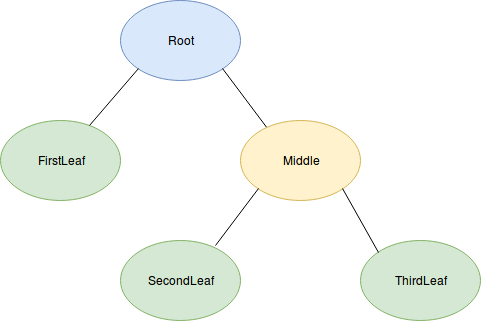

-------------------------------------

# Algorithms and Data Structures 1

## Trees and Advanced Recursion

-------------------------------------

## Contents

* Data Structures
  * Some data structures you already know
  * A new data structure - the Tree

-------------------------------------

## Data Structures

When we program in JavaScript, it is often tempting to think about what we are doing in terms of the features of the language and the types the language recognises. One variable might hold an array, another variable might contain an object.

In computer science however we tend to think of the way data is structured at a more abstract level, in terms of what the data structure allows us to do. An array allows us to keep a list of items, and an object lets us pair arbitrary keys with values through its flexible approach to adding properties.

### Some data structures you already know

* The List

The simplest way to structure data and still be able to call it a data structure is to have an unordered List of items that we can shrink and grow as needed. JavaScript's array gives you all the tools to list items in this way.

* The Dictionary

When we look a word up in the dictionary, we see its definition. Similarly, a Dictionary data type lets us set or retrieve a value associated with a key we provide.

When we use an object in this way:
```js
myObject[key] = value;
```
we are treating it as a Dictionary. We can set any value we choose and retrieve it later.

### A new data structure - the Tree

* The Tree

A Tree data structure has a single "root node", and "branches" from there to other nodes. A node with no branches attached is called a "leaf node". Nodes may have values attached, or may not.

Here is a diagram of a possible Tree:



You will note the "root node" is at the top. Traditionally in Computer Science trees are drawn growing down from their roots. This may lead you to draw your own conclusions on how often Computer Scientists go outside.

When you are going up the tree toward the root node, the node directly above the current node is called the "parent node" or sometimes just "parent", and any nodes which are on branches that descend below the current node are called "child nodes" or sometimes just "children".

Here is one way you might build that tree with JavaScript objects:
```js
var tree = {
	name: "Root",
	children: [
		{
			name: "FirstLeaf"
		},
		{
			name: "Middle",
			children: [
				{
					name: "SecondLeaf"
				},
				{
					name: "ThirdLeaf"
				}
			]
		}
	]
};
```

This may look quite confusing at first glance! However, you'll probably spot that each of the objects in the JavaScript corresponds to a node in the tree, and the children of each node are marked in the JavaScript by belonging to a property called `children`.

Tree data structures are very common in programming. Files are stored in a directory tree. HTML tags are laid out in a tree structure, with parents and children. More than this, any time we encounter nested objects, we can think of them as a sort of tree. This is also a tree:

```js
var repositoryData = {
	name: "MyRepo",
	owner: {
		name: "Peter",
		lastLoggedOn: "yesterday",
		lastUpdatedRepo: "yesterday"
	},
	files: [
		{
			name: "index.html",
			size: "1260"
		},
		{
			name: "exercise.js",
			size: "204"	
		}
	]
}
```

If you consider each property as a node in its own right and use `Object.keys` to get the children of array and object properties, you can use some of the same techniques you would apply to any other tree.

#### Exercises:
* Make a new branch in the ads1 repo called *week-2*
* Do the exercises in *week-2/Trees*

